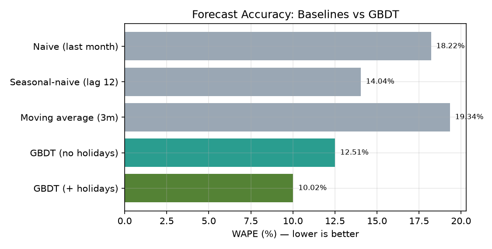
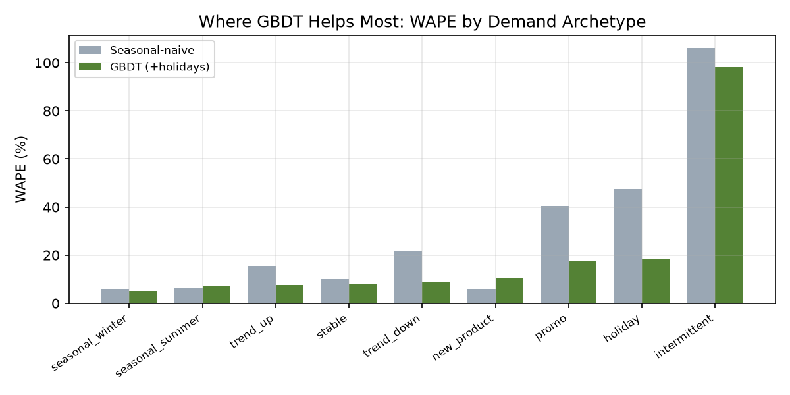
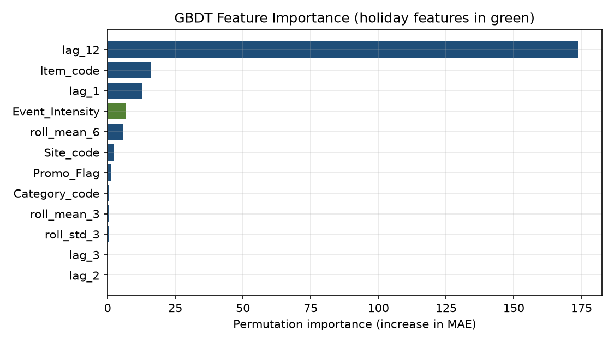
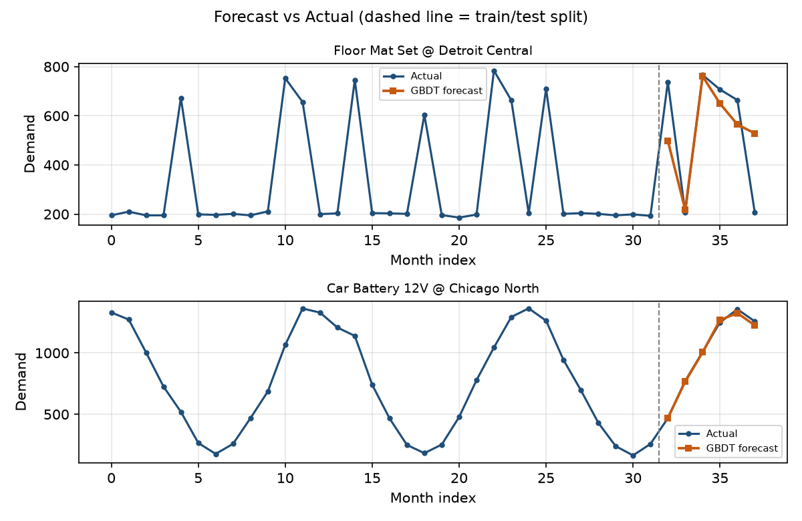
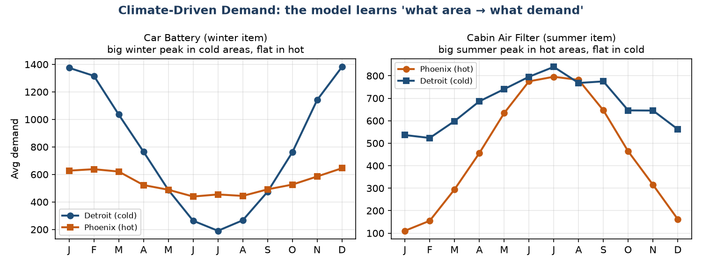

# 📦 Smart Inventory Optimization System (SIOS) — Demand Forecasting

Machine-learning demand forecasting for **traded automotive spare parts**, forecasting demand for **each item, at each warehouse, for each month**, and turning those forecasts into **safety-stock and reorder-point** recommendations — to cut stockouts *and* overstock at the same time.

> **Headline result:** a Gradient Boosted Decision Tree (GBDT) hits **~10% WAPE / 0.71 MASE**, beating every baseline — and adding an external **Holidays & Events** feed improves accuracy by **~20% (relative)**, proven with an ablation study.

---

## 🎯 The problem
Poor demand forecasting causes two costly failures: **stockouts** (lost sales) and **overstock** (frozen capital). Both are downstream of one thing — *how well you predict demand*. SIOS forecasts demand at the **item × warehouse × month** grain and converts it into an inventory policy.

The target is **True Demand** (not raw sales, which are censored by your own stock):

```
True Demand = Delivered + Back-ordered + Lost Sales − Returns
```

## 📊 Results (out-of-time test set)

| Model | WAPE % | MASE |
|---|---|---|
| Naive (last month) | 18.2 | 1.30 |
| Seasonal-naive (lag-12) | 14.0 | 1.00 |
| GBDT (no holidays) | 12.5 | 0.89 |
| **GBDT (+ Holidays & Events)** | **10.0** | **0.71** |

**Adding Holidays & Events data → ~20% relative WAPE improvement** (the project's core hypothesis, validated by ablation).

| Baselines vs GBDT | By archetype | Feature importance |
|---|---|---|
|  |  |  |

**Forecast vs actual** (holiday-driven & seasonal SKUs) — and **climate-driven demand** (same item, cold vs hot region):

| Forecast vs actual | Climate effect |
|---|---|
|  |  |

## 🧠 How it works
```
ERP data → True Demand (Item×Site×Month)
   → features: lags, rolling windows, calendar, Holidays & Events
   → models: baselines, ARIMA, GBDT (dual-model selection by WAPE)
   → walk-forward (out-of-time) evaluation: MAE / RMSE / WAPE / MASE
   → inventory policy: Safety Stock = z·σ·√LT ; Reorder Point = demand·LT + SS
   → Streamlit app + Docker
```

The included **20,000-row dataset** (40 items × 10 warehouses × 50 months) embeds **8 demand archetypes** (stable, trending, seasonal, intermittent, promotional, holiday-driven, new-product) plus **climate/region** effects and a **year-varying** Holidays & Events calendar — so the holiday signal carries information a plain calendar cannot.

## 🛠️ Tech stack
Python · pandas · scikit-learn (HistGradientBoosting — same family as XGBoost/LightGBM) · Matplotlib · **Streamlit** (UI) · **Docker**

## 🚀 Run it

**Option A — Docker (recommended)**
```bash
docker compose up        # or: docker build -t sios . && docker run -p 8501:8501 sios
```
Open **http://localhost:8501**

**Option B — Python (3.12)**
```bash
pip install -r requirements.txt
streamlit run app.py
```

**Re-generate / retrain (optional)**
```bash
python generate_data.py   # rebuild the 20k dataset + holidays calendar
python train_model.py     # retrain GBDT, print metrics, write charts to results/
python dist_charts.py     # distribution / EDA charts
python gen_explain.py     # data-generation explanation charts
```

The **Streamlit app** has 5 tabs: Forecast Explorer (with uncertainty band), **Inventory & Reorder** (what-if safety-stock simulator), Model Performance, Feature Importance, and Data.

## 📁 Project structure
```
app.py                  Streamlit web app (upload data → forecasts)
generate_data.py        builds the 20k synthetic dataset + holidays calendar
train_model.py          preprocessing → features → GBDT → evaluation
dist_charts.py          distribution / EDA charts
gen_explain.py          data-generation explanation charts
sios_demand_panel.csv   the dataset (Item × Site × Month)
sios_holidays.csv       Holidays & Events calendar
sios_items.csv          item master (archetypes)
Dockerfile, docker-compose.yml, requirements*.txt
DEPLOYMENT_GUIDE.md     full run + troubleshooting guide
results/                metrics + charts
```

## 📈 Dataset
`sios_demand_panel.csv` — columns: `Period, Year, Month, Item, Category, Archetype, Site, Region, Climate, Demand, Actual_Issue, Lost_Sales, Returns, Promo_Flag, Unit_Price`. The model target is `Demand`.

---

**Author:** Swapnil Valvekar · [LinkedIn](https://www.linkedin.com/in/swapnil-valvekar-b75881159/) · [GitHub](https://github.com/SwapnilValvekar)
